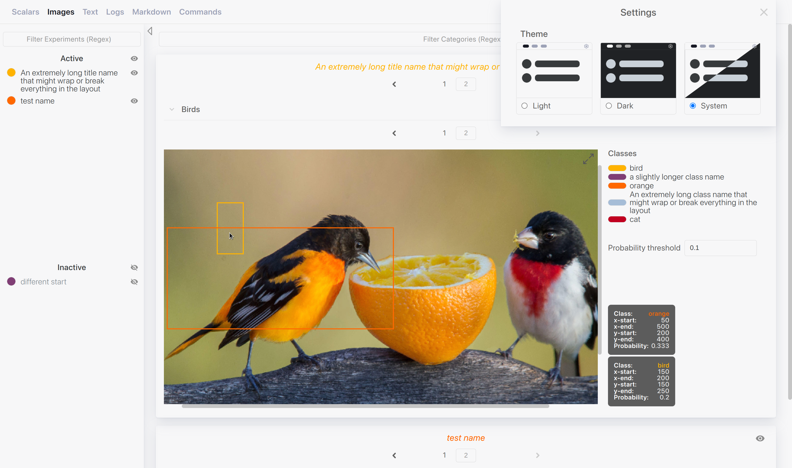

# Log and Visualise Data (Lavd)




Tracking the progress of Machine Learning (ML) experiments is essential for
deciding what model works well with the available data. Using some kind of
metric, for example Intersection over Union (IoU) for object detection, gives
a good idea of the quality of the model, but additionally, it is important to
also see a particular example to get a better intuition. This, and more can be
logged and visualised in an interactive manner, including:

- Scalars
- Images
- Text
- Log files
- Markdown documents
- CLI commands (how to run the experiment with the same parameters)

_...and more to come._

## Table of Contents

- [Table of Contents](#table-of-contents)
- [Getting Started](#getting-started)
- [Logging Data](#logging-data)
  - [Scalars](#scalars)
  - [Images](#images)
  - [Text](#text)
  - [Markdown](#markdown)
  - [Command Line Options](#command-line-options)
  - [Summary](#summary)
  - [Printing](#printing)
  - [Spinner](#spinner)
  - [Progress Bar](#progress-bar)
  - [Saving a PyTorch Model](#saving-a-pytorch-model)
  - [Saving any Object](#saving-any-object)
  - [Disabling the Logger](#disabling-the-logger)
- [Data Layout](#data-layout)
- [Comparison to TensorBoard](#comparison-to-tensorboard)
- [Known Issues](#known-issues)
  - [Inotify watch limit reached](#inotify-watch-limit-reached)

## Getting Started

Installing with pip:

```sh
pip install --user --upgrade lavd
```

Once installed, the server can be started by running `lavd` with the directory
containing the (logged) data:

```sh
lavd path/to/logs
```

Or if you prefer to run it as a module instead of using the executable (both
versions do exactly the same):

```sh
python -m lavd.server path/to/logs
```

## Logging Data

_Lavd_ includes a logger that can be used to easily log all the desired data.

```python
import lavd

# Logs everything to log/some-experiment-name/
# If no name is giving it the current date and time are used as a name
logger = lavd.Logger("some-experiment-name")
```

### Scalars

Scalars will be plotted and unlike other categories, the have to be assigned to
a step.

```python
logger.log_scalar(0.8, "accuracy", step=1)
logger.log_scalar(0.6, "accuracy", step=2)
logger.log_scalar(0.3, "accuracy", step=3)

logger.log_scalar(0.1, "easy/accuracy", step=7)
logger.log_scalar(0.05, "easy/accuracy", step=14)
```

### Images

Logging images with optional bounding boxes that for interactive visualisation.

```python
 # Saves image to: log/some-experiment-name/0001/bird.png
logger.log_image(image, "bird", step=1)
 # Saves image to: log/some-experiment-name/0001/other/bird.png
logger.log_image(image, "other/bird", step=1)
# No step saves it to: log/some-experiment-name/other/bird.png
logger.log_image(image, "other/bird")

# With bounding boxes, each box is given by 2 points: top-left and bottom-right.
boxes = [
    {
        "xStart": 100,
        "yStart": 100,
        "xEnd": 150,
        "yEnd": 200,
        "className": "bird", # Optional
        "probability": 0.4,  # Optional
    },
    # Another bounding box, without class or probability
    {"xStart": 200, "yStart": 22, "xEnd": 233, "yEnd": 80,},
]
# List of available classes
classes = ["bird", "orange", "background"]
# Threshold to count boxes as valid and threfore visible
threshold = 0.2
logger.log_image(
    img,
    "birds-with-bounding-boxes",
    step=3,
    boxes=boxes,
    classes=class_names,
    threshold=threshold,
)
```

### Text

Text can be logged with an additional expected text, which then shows a diff
between the actual text and the expected, otherwise it's just the text.

```python
logger.log_text("The quick brown fox...", "famous-sentence", step=1)
# With an expected text
logger.log_text("hello world", "with-diff", step=2, expected="Hallo Welt")
```

### Markdown

Markdown files are given as Markdown string.

```python
logger.log_markdown("# Hello\n\nMore markdown...", "some-markdown")

logger.log_markdown("# Step 1\\nn## Result\n\nGood", "for-step", step=1)
```

### Command Line Options

Command line arguments that have been used to start the experiment and all
available options for that script can be saved, if you use `argparse` to parse
the command line options.

```python
import argparse

parser = argparse.ArgumentParser()
# Add all options with: parser.add_argument()
# ...
args = parser.parse_args()

logger.log_command(parser, args)
```

### Summary

A summary of the current experiment, including current git commit, diff of the
working tree and possible more information, can be saved as a Markdown document.
There are two parts of the summary that can be configured, short infos that are
presented is an unordered list given as a dictionary, where the key is the label
(can be nested for nested lists), and additional sections at the end of the
document given as a dictionary where the key is the section title and the value
is either the raw string of the content or a list of lines.

```python
# Regular summary
logger.log_summary()


infos = {"size": {"train": 1000, "validation": 50}}
sections = {
    "Additional raw Information": "Some text\nand more",
    "Same but with Lines": ["Some text", "and more"],
}
logger.log_summary(infos, sections)
```

### Printing

Print functions act as print() combined with "".format() but also log all the
messages into a log file in addition to printing.

```python
#               Message              ...Format arguments
logger.println("{}, message: {num}", "Hello", num=1)
# => Hello, message: 1

# Same but to STDERR instead of STDOUT
logger.eprintln("{}, message: {num}", "Hello", num=1)
```

Nicely formatted tables with `print_table`:

```python
header = ["Name", "Correct", "Total", "Accuracy"]
rows = [
    ["Train", 978, 1000, 0.978],
    ["Validation", 90, 100, 0.9],
    ["Test", None, 50, None],
]
logger.print_table(header, rows)
# | Name       | Correct | Total | Accuracy |
# |------------|---------|-------|----------|
# | Train      | 978     | 1000  | 0.97800  |
# | Validation | 90      | 100   | 0.90000  |
# | Test       | -       | 50    | -        |
```

### Spinner

A small wrapper around [Halo][halo], that also logs start and end of the
duration to a log file. Requires a name as the first argument, which will be
used in the log file and as the text next to the spinner, unless the `text`
argument is supplied. All additional arguments are forwarded to `Halo`.

```python
with logger.spinner("Loading..."):
    # Do something that takes a while

# Without context manager, but also some arguments for Halo
spinner = logger.spinner("Manual spinner", spinner="smiley", placement="right")
spinner.start()
# Do something
spinner.stop()
```

### Progress Bar

A small wrapper around [tqdm][tqdm], that also logs start and end of the
duration to a log file. Requires a name as the first argument, which will be
used in the log file and as the text next to the progress bar, unless the `desc`
argument is supplied. All additional arguments are forwarded to `tqdm`.

```python
for d in logger.progress_bar("Train", data):
    # Trainings loop

# With context manager and manual update
with logger.progress_bar("Manual progress bar", total=100) as pbar:
    while True:
      # Do something

      # Update the progress bar by 4 steps
      pbar.update(4)
```

### Saving a PyTorch Model

_[PyTorch][pytorch] is optional, but must be installed to use this feature._

Saves the state dict of a PyTorch model and optionally its current gradients. If
the model is a Multi-GPU/Node model (i.e. `nn.DataParallel` or
`nn.parallel.DistributedDataParallel`) it will automatically be unwrapped to be
compatible with the initial model.

```python
model = ResNet101()
logger.save_model(model, step=3)

distributed_model = nn.parallel.DistributedDataParallel(
    model, device_ids=[gpu_id], find_unused_parameters=True
)
# Distributed model and also saving the gradients
logger.save_model(distributed_model, step=4, grads=True)
```

### Saving any Object

_[PyTorch][pytorch] is optional, but must be installed to use this feature._

Saves any object by serialising it with `torch.save`.

```python
logger.save_obj({ "key": 99 }, "a-dict")

logger.save_obj((1, 2), "some_tuple", step=4)
```

### Disabling the Logger

All logging actions can be disabled, either creating a disabled logger or by
later disabling it. The logging actions will be a no-op instead and all methods
can be used as if they were a regular logger but without having any output.
Methods that produce some useful information without logging anything continue
to function as usual.

Disabling the logger is particularly useful when the same script is launched
multiple in multiple processes, but only the main process should create the
logs.

```python
# Create a disabled logger
# No log directory will be created
logger = lavd.Logger("some-experiment-name", disabled=True)

# Does nothing
logger.println("hello")

# Won't show the spinner
with logger.spinner("Loading..."):
    # Do something that takes a while

# Create a normal logger
logger = lavd.Logger("some-experiment-name")

# Disable it later
logger.disable()

# Enable it (also works if the logger was initially disabled)
logger.enable()
```

## Data Layout

The server picks up any data that is present in the specified log directory that
can be displayed, but certain functionalities require a specific layout or file
format (but still human readable).

In the root of log directory (i.e. path given to `lavd`) the different
experiments are listed by name. Each experiment is in its own directory. Any
other file at the top level will be ignored, since it cannot be associated to
one experiment.

Within each experiment directory, there are numbered directories, which acts as
a step (epoch) within the experiment, and all files within that directory
belongs to that specific step. They are usually padded with zeros e.g. `0001`,
but that is not required, it only helps to show them in the correct order for
tools, such as `ls`, that shows them in lexicographical order. Since
`0001 == 01 == 1`, multiple representations of the same numbers will be in
conflict with each other, and should therefore be avoided.

Every other file, including nested files, are used as data based on their file
type and the relative path is used as a category label (minus the extension).
For example, the `some-experiment-name/0001/bird.png` is an image belonging to
the `some-experiment-name` experiment, of step 1 and with the label `bird`.
The same label can contain multiple data, let's say there is also a `bird.md`
file, so there would be a Markdown document with the label `bird`. The same
base name can therefore be used for different files, as long as they are in
a different category, this means that just using a different extension will
create a conflict (e.g. `birds.png` and `birds.jpeg`) and should also be
avoided.

Files not within a step directory are considered global to the experiment
(including nested files) and once in a nested directory, numbered directories
are just regular directories, not specific steps, for example
`some-experiment-name/other/0001/still-global.md` is a global to
`some-experiment-name` with the label `other/0001/still-global`.

There is one exception to the rule above, and that's for commands. Only
command is used per experiment, and it's the `commands.json` file, directly
inside the experiment directory, i.e. `some-experiment-name/commands.json`. Any
other file containing the commands, will not be displayed (just the command, all
other categories are still shown even if they are in a nested `command.json`)

JSON files are special in the sense that they can contain multiple kinds of
data. They are separated within the JSON file by using the appropriate keys.

The following directory structure is demonstrates the key ideas:

```sh
log/
├── some-experiment-name
│   ├── 0001                        # Step: 1
│   │   ├── bird.png                # Label: bird
│   │   ├── bird.json               # Label: bird
│   │   ├── bird.md                 # Label: bird
│   │   └── difficult
│   │       └── unlabelled
│   │           └── some image.png  # Label: difficult/unlabelled/some image
│   ├── 0002                        # Step 2
│   │   └── bird.png
│   ├── command.json                # Only command that can contain command definitions
│   ├── events.log
│   ├── other                       # Nested global
│   │   ├── 0001                    # Not a step directory!
│   │   │   └── still-global.md     # Label: other/0001/still-global
│   │   └── instructions.md         # Label: other/instructions
│   └── summary.md
├── yet-another-experiment
│   └── 0007
│       └── bird.png
├── top-level-file.md               # ignored
│
...
```

## Comparison to TensorBoard

[TensorBoard][tensorboard] is one of the most used tools for this purpose and
is undoubtedly incredibly useful. Unfortunately, it also has its drawbacks,
hence _Lavd_ was created with a different set of goals. One of the biggest
annoyances from of TensorBoard is the fact that everything is serialised, which
means that you cannot inspect the data directly without deserialising it first.
If sufficiently large amount of data is logged, it takes a while to see the last
event, because everything is deserialised in order. Additionally, something like
images cannot just be viewed with any other tool, since they are not saved as
image files. TensorBoard also limits the number of steps that can be viewed for
something for images or text, presumably to not blow up the serialised data, and
you cannot see anything in between or even decide which ones you want to keep.

_Lavd_ leverages the file system and the data can be freely viewed and edited
just like any other file, while still being picked up for the visualisation.
That also comes with its own drawbacks compared to serialising the data,
for example using more disk space, although that is almost certainly
a non-issue.

Another difference to TensorBoard is that it does not revolve around TensorFlow
graphs or tensors or Machine Learning in general, but focuses more on the actual
data. Even though TensorBoard has been used for a while with PyTorch, the
graphs are not really the focus of that, but it's mostly used to log the
scalars, text, images etc. While the graph visualisation are nice, they are not
used all that often, because once the graph has been seen there is just no
reason to create it again, but there are countless experiments that use the
exact same graph. This also means that _Lavd_ does not try to cover everything
that TensorBoard does. Of course there are also features that TensorBoard does
not cover.

## Known Issues

### Inotify watch limit reached

```
OSError: [Errno 28] inotify watch limit reached
```

The error occurs if there are too many files that are being watch at the same
time. You can check how many watches are allowed as follows:

```sh
cat /proc/sys/fs/inotify/max_user_watches
# => 8192
```

The default is 8192 on most systems. To solve the issue the limit needs to be
increased:

```sh
sudo sysctl fs.inotify.max_user_watches=524288
```

[halo]: https://github.com/manrajgrover/halo
[pytorch]: https://pytorch.org
[tensorboard]: https://github.com/tensorflow/tensorboard
[tqdm]: https://github.com/tqdm/tqdm
